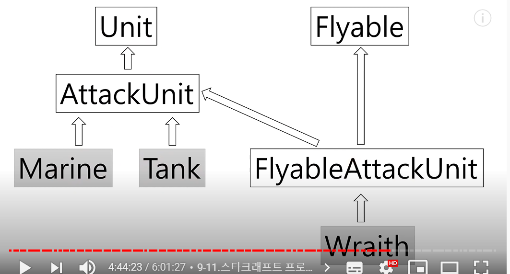

### 파이썬 2일차 강의

* 표준 입출력

```python
# print('python','java', sep = ',', end='?') #sep를 통해 사이부분에 어떤 문자를 넣을 수 있다.
# print('무엇이 더 재밌을까요?')

scores = {"수학" : 0, "영어" : 50, "코딩" : 100}
for subject, score in scores.items():
    # print(subject,score)
    print(subject.ljust(8),str(score).rjust(4),sep = ':') #ljust = 왼쪽으로 정렬 , rjust는 4칸 오른쪽으로 정렬

for num in range(1,21):
    print('대기번호 : ',+ str(num).zfill(3)) #zfill은 빈공간3개를 확보하고, 빈공간에 0을 넣는다
```

* 다양한 출력 포멧


* 파일 입출력

  * 파이썬을 통해 파일을 열수 있다. open을 사용
  * close를 통해 마지막에 파일을 닫아야 한다.

  

  > 위와 같이 입력할 경우, score.txt라는 파일이 생성되고, 수학 : 0 , 영어 : 50 이 그 파일에 입력되어 있다.

```python
score_file = open('score.txt', 'w',encoding ='utf8') #기존 파일에 추가로 기입할때, 'a'를 사용 / 엔코딩은 무조건 utf8사용
print('수학 : 0', file = score_file)
score_file.write('영어 : 80')
score_file.close()
# print로 입력해도 되고, write를 써서 입력해도된다.

score_file = open('score.txt','a', encoding ='utf8') #기존 파일에 추가로 기입할때, 'a'를 사용 / 엔코딩은 무조건 utf8사용
score_file.write('\n과학 : 80')
score_file.write('\n코딩 : 100')
score_file.close()
```

  * 파일 읽어오기

```python
score_file = open('score.txt','r', encoding ='utf8') 
print(score_file.read())
# print(score_file.readline())을 사용해서 한줄씩 읽어옴
score_file.close()
#반복문을 통해 파일이 총 몇줄인지 모를때도 출력이 가능하다

score_file = open('score.txt','r', encoding ='utf8') 
lines = score_file.readlines() #리스트 형태로 파일의 모든 줄을 저장
for line in lines:
    print(line, end='')
score_file.close()
```

* 피클

```python
import pickle
# profile_file = open('profile.pickle','wb') #피클은 인코딩을 따로 하지 않아도 된다
# profile = {'이름':'박명수', '나이':30}
# print(profile)
# pickle.dump(profile,profile_file) # profile 에 있는 정보를 file에 저장
# profile_file.close()

profile_file = open('profile.pickle','rb')
profile = pickle.load(profile_file) #파일에 있는 정보를 프로필에 불러오기
print(profile)
profile_file.close()
```

* with


> with as를 사용해서  파일을 불러올수 있다


> 간편하게 with를 사용해서 파일을 쓰고, 불러올 수 있다.

* 예제7- 보고서파일만들기

```python
# 매주 1회 보고서 만들기
# x 주차 주간보고서
# 부서 : 
# 이름 : 
# 업무 요약 :
# 1주차 부터 50주차 까지의 보고서를 만드는 프로그램 제작하기

for mon in range(1,51):
     with open('{0}주차.txt'.format(str(mon)),'w',encoding='utf8') as report_file:
         report_file.write('- {0}주차 주간보고서 -'.format(mon))
         report_file.write('\n  부서 : ')
         report_file.write('\n  이름 : ')
         report_file.write('\n  업무 요약 : ')
```

* 클래스

>  반복되는 작업을 편하게 만들어 주는게 클래스

> 하나의 틀이라고 생각하면됨, 함수의 집합

```python
class Unit:
    def __init__(self,name,hp,damage):
        #__init__은 파이썬에서 쓰이는 생성자
        self.name = name
        self.hp = hp
        self.damage = damage
        print('{0}유닛이 생성 되었습니다.'.format(self.name))
        print('체력{0}, 공격력{1}'.format(self.hp,self.damage))
        
marine1 = Unit('마린', 40, 5)
# 클래스로부터 객체 생성
marine2 = Unit('마린', 40, 5)
```

* 멤버변수 

> 클래스 내에서 정의된 변수, 클래스 외부에서 `객체이름.멤버변수`로 멤버변수를 끌어다가 사용할수 있다.

> 클래스 외부에서 추가적으로 멤버변수를 생성할수 있다. 하지만 해당 객체에서만 사용가능!!

* 메소드

```python
class Unit:
    def __init__(self,name,hp,damage):
        #__init__은 파이썬에서 쓰이는 생성자
        self.name = name
        self.hp = hp
        self.damage = damage
        print('{0}유닛이 생성 되었습니다.'.format(self.name))
        print('체력{0}, 공격력{1}'.format(self.hp,self.damage))

class AttackUnit:
    def __init__(self,name,hp,damage):
        self.name = name
        self.hp = hp
        self.damage = damage
  
    def attack(self, location):
        print('{0} : {1} 방향으로 적군을 공격 합니다. [공격력 {2}]'.format(self.name, location, self.damage))

    def damaged(self, damage):
        print('{0} : {1} 데미지를 입었습니다.'.format(self.name, damage))
        self.hp -= damage
        print('{0} : 현재 체력은 {1} 입니다.'.format(self.name, self.hp))
        if self.hp <= 0:
            print('{0} : 파괴되었습니다.'.format(self.name))

#파이어뱃
firebat1 = AttackUnit('파이어뱃', 50, 16)
firebat1.attack('5시') 
firebat1.damaged(25)
firebat1.damaged(25)
```

* 이전 클래스의 멤버변수를 상속받는 방법

> 상속받는 유닛에 (클래스)를 만듬


* 다중 상속 & 메소드 오버라이딩

```python
class Unit:
    def __init__(self,name,hp,speed):
        #__init__은 파이썬에서 쓰이는 생성자
        self.name = name
        self.hp = hp
        self.damage = damage
        print('{0}유닛이 생성 되었습니다.'.format(self.name))
        print('체력{0}, 공격력{1}'.format(self.hp,self.damage))
    
    def move(self, location):
        print('[지상유닛이동]')
        print('{0} : {1} 방향으로 이동합니다. [속도 {2}]'.format(self.name, location, self.speed))

class AttackUnit(Unit): # 클래스 유닛 상속
    def __init__(self,name,hp,speed,damage):
        Unit.__init__(self, name, hp, speed) # 클래스 유닛 상속
        self.damage = damage
  
    def attack(self, location):
        print('{0} : {1} 방향으로 적군을 공격 합니다. [공격력 {2}]'.format(self.name, location, self.damage))

    def damaged(self, damage):
        print('{0} : {1} 데미지를 입었습니다.'.format(self.name, damage))
        self.hp -= damage
        print('{0} : 현재 체력은 {1} 입니다.'.format(self.name, self.hp))
        if self.hp <= 0:
            print('{0} : 파괴되었습니다.'.format(self.name))

class flyable:
    def __init__(self, flying_speed) :
        self.flying_speed = flying_speed
    
    def fly(self, name, location):
        print('{0} : {1} 방향으로 날아갑니다. [속도 {2}]'.format(name, location, self.flying_speed))
    
class FlyableAttackUnit(AttackUnit, flyable): # 클래스 어택유닛, 플라이애이블 다중상속
    def __init__(self, name, location, hp, damage, flying_speed):
        AttackUnit.__init__(self,name, hp, 0, damage) #지상 속도는 0, # 클래스 어택유닛 상속
        flyable.__init__(self, flying_speed) # 클래스 플라이애이블 상속
        print('{0} : {1} 방향으로 날아갑니다. [속도 {3}, 공격력 {2}]'.format(name, location, damage, flying_speed))
 #################################   
벌처 = AttackUnit('벌처', 80, 10, 20)
배틀크루저 = FlyableAttackUnit('배틀크루저', '1시' ,500,25,3)

벌처.move("11시")
배틀크루저.fly('배틀크루저','1시')

#여기서 클래스를 통해 각 유닛의 상태를 지정하고,
#함수를 이용해 원하는 것을 프린트 한다고 생각하면됨!!
```

> `pass` 기능을 통해 프로그램을 아무것도 하지 않은채 다음으로 넘어감

> `Super()`기능을 사용하여, class를 상속할때, self없이 사용가능, (단, 다중상속을 할 경우에는 처음순서 하나의 클래스만 상속만 된다, 따라서 다중 상속을 할때는 사용하지 않는게 좋다!!)

> `IF isinstance `: 해당 객체 해당하는지 확인하는 것  

* 스타크래프트를 통한 예시


> 각 유닛마다 클래스를 생성한 뒤, 상속 기능을 통해 호출 

> `어택유닛-> 유닛`(클래스)이 상속되어 있음 , 즉 마린 클래스를 입력하면 `어택유닛->유닛`(클래스) 순으로 상속되어서 유닛의 함수가 호출됨



