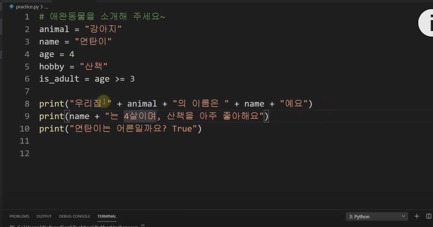
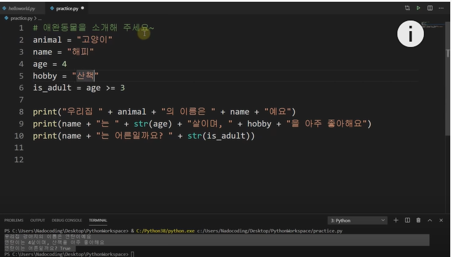
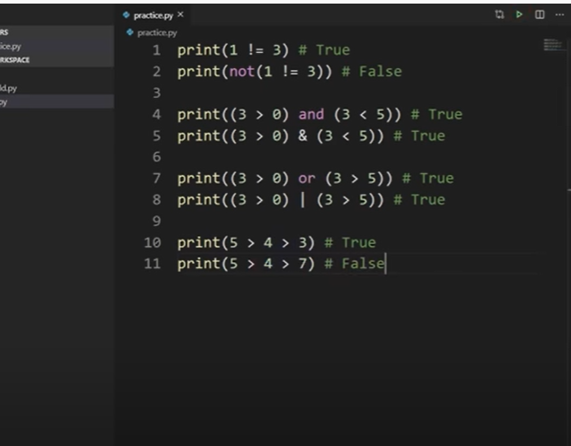
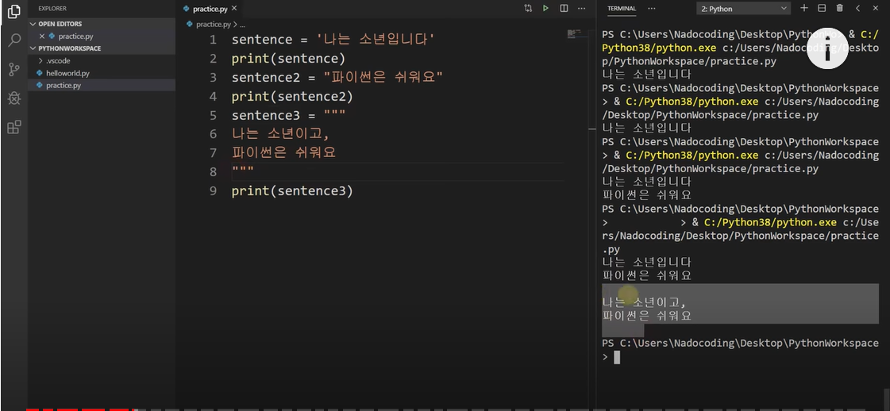
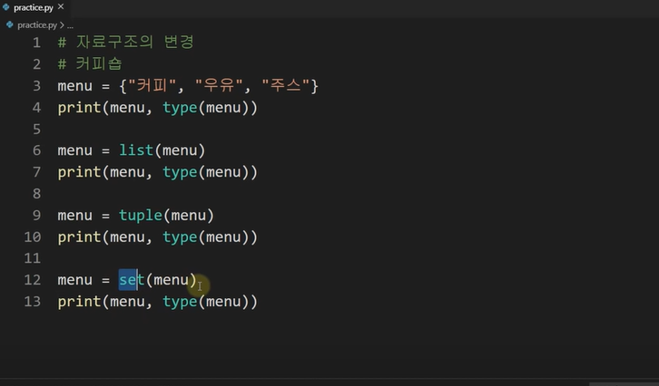
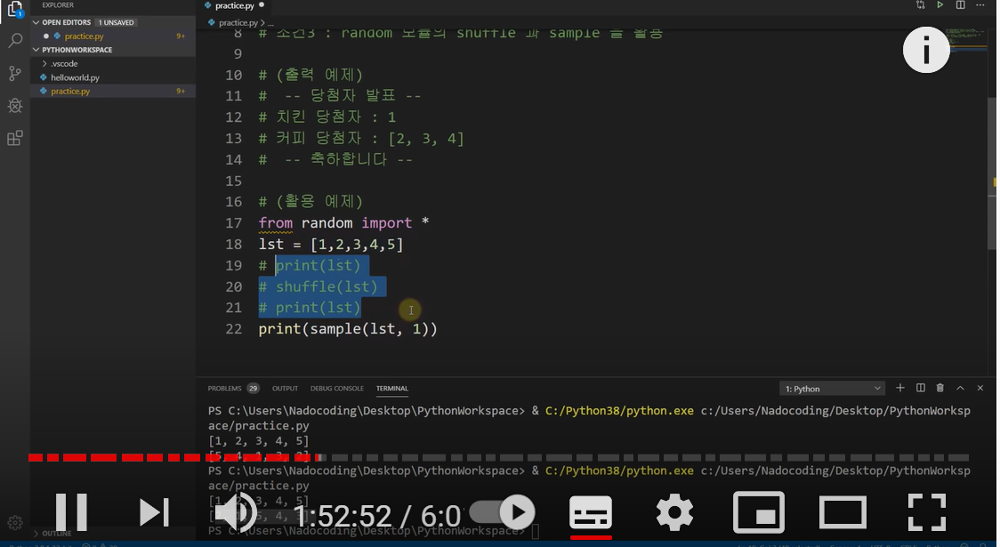

### 파이썬 시작해보기

* 문자형 자료를 출력하기 위해서는 '문자' or "문자" 라고 표현해야 출력이 된다
* 숫자형은 따옴표없이 표현가능
* 문자랑 숫자를 혼합해서 사용가능
* bolean -> 참거짓
* print(not true) -> false ->not은 반대를 의미
* 주석은 #으로 표현
* 변수지정 = > name = "연탄이" 처럼 변수를 선정하고, 변수에 의미를 정의
* `+`변수`+` 로  입력하면 된다



* STR( 정수형) => 정수형을 문자형으로 변환시켜주는 작업

* bollean도 정수형처럼 STR로 처리해주어야 한다.

  

* `+`가 아닌`,`로도 문자열을 합칠수 있으나 `,`를 쓰면 한번 띄워지고 표현된다

* (''') 을 사용하면 여러 문장을 한번에 주석처리 된다

* ctrl+`/ `를 써서 주석을 전체 처리하거나 해제할수 있다

  ```python
  print(2**3) # 2^3
  print(5%3) # 나머지 구하기, 2
  print(5//3) #몫 구하기, 1
  print(10>3) #비교연산, Ture
  #`>=` 크거나 같다
  print(3 == 3) # true , ==은 같다
  print (4 ==2) # False
  print(1 != 3) # true , !과 not은 반대를 의미
  # and = & -> 모두가 True여야 true
  # or = | -> 둘중 하나가 true여야 true 
  ```

  

* 수식

  ```python
  #파이썬은 우리가 알고 있는 순서대로 계산한다
  # 변수에 수식을 넣고 변수로 계산해도 된다
  number = 2+3*4
  number = number +2
  nuber += 2 #윗줄과 같은 의미
  print(number) # 18
  number %= 2
  print(number) #0
  ```

  

* abs(값) # 절대값
* pow(4,2) # 4^2
* max(5,2) # 5 ,최댓값
* min() # 최소값
* round() # 반올림
* floor() # 내림
* ceil() # 올림
* sqrt() # 제곱근

```python
from random import *
##랜덤라이브러리를 사용하겠다
print(random())
#0.0~1.0미만의 임의의 값 생성
print(random()*10) 
# 0.0~ 10.0 미만의 임의의 값 생성
print(int(random()*10))
#0~10 미만의 임의의 값 생성 int= 정수형
print(int(random()*10+1))
#1~10이하의 임의의 값 생성
print(randrange(1,46)) 
#1~46 미만의 임의의 값 생성
print(randint(1,45))
#1~45이하의 임의의 값 생성
```

* 문자열 



* 슬라이싱 

```python
jumin = '950105-140000'
#슬라이싱은 필요한 정보만 가져오는 것
print('성별 : ' + jumin[7])
#7번째 자리의 정보를 가져옴
print('연 : ' + jumin[0:2])
#0~2직전까지 자릿수의 값을 가져옴
print('월 : ' + jumin[2:4])
print('일 : ' + jumin[4:6])
print('생년월일 : ' + jumin[0:6])
print('생년월일 : ' + jumin[:6])
#처음부터 6직전까지 자릿수를 뽑아옴
print('뒤 7자리 : '+ jumin[7:])
print('뒤 7자리 : '+ jumin[-7:])
#맨뒤에서 7번째 자리부터 끝까지
```

* 문자열 처리 함수

```python
python = 'Python is Amazing'
print(python.lower())
#모든 문자를 소문자로
print(python.upper())
#모든 문자를 대문자로
print(python[0].isupper())
#첫번째가 대문자인지?
print(len(python))
#문자열의 전체 길이확인
print(python.replce('python','java'))
#replace를 활용해서 해당 문자를 바꿈
index = python.index('n')
print(index)
#첫번째 n의 위치 확인
index = python.index('n',index + 1)
print(index)
#두번째 n의 위치 확인
print(python.find('java'))
#-1
print(python.index('java'))
#오류나서 프로그램 종료됨
print(python.count('n'))
# 문장에 n이 몇개 있는지 확인
```

* 문자열 포맷

```python
print('나는 %d살입니다.'% 20)
#%d 는 정수를 입력할때 사용
print('나는 %s살입니다.'% '파이썬')
#%s 는 문자열를 입력할때 사용
print('Apple은 %c로 시작해요.'% 'A')
#%c는 한글자만 입력할때 사용
print('나는 %s색과 %s색을 좋아해요.' %('파란','빨간'))

print('나는 {} 살입니다.' .format(20))
print('나는 {}색과 {}색을 좋아해요.' .format('파란','빨간'))
#나는 파란색과 빨간색을 좋아해요
print('나는 {0}색과 {1}색을 좋아해요.' .format('파란','빨간'))
#나는 파란색과 빨간색을 좋아해요
print('나는 {1}색과 {0}색을 좋아해요.' .format('파란','빨간'))
#나는 빨간색과 파란색을 좋아해요

print('나는 {age}살이며, {color}색을 좋아해요.' .format(age = 20, color = '빨간'))
# 나는 20살이며, 빨간색을 좋아해요

age = 20
color = '빨간'
print(f'나는 {age}살이며, {color}색을 좋아해요.')
```

* 탈출문자

```python
print('백문이 불여일견 \n 백견이 불여일타')
# \n 은 줄바꿈
print('저는 "나도코딩" 입니다.')
# 저는 나도 코딩입니다.
print("저는 \"나도코딩\" 입니다.")
# 저는 나도 코딩입니다. , 같은 따옴표를 사용하고 있을때는 \'를 사용해서 문자열에 따옴표를 출력할수 있다.

# \\ : 문장 내에서 \ 로 출력
print('c:\\user\\nadocding')
# c:\user\nadocding
#\r : 커서를 맨앞으로 이동
print('Red Apple\rpine')
#pine Apple -> 앞으로 이동한 뒤에 pine을 적는다
#\b : 백스페이스 (한 글자 삭제)
print('redd\bApple')
#redApple
#\t : 탭
print('red\tapple')
```

* 리스트

```python
subway = [10, 20, 30]
print(subway)
subway = ['유재석', '조세호', '박명수']
print(subway.index('조세호'))
subway.append('하하') #append : 맨뒤에 붙임
print(subway)
 ['유재석', '조세호','박명수','하하']
subway.insert(1,'정형돈') #지정된 위치에 붙임
print(subway)
# ['유재석', '정형돈','조세호','박명수','하하']

print(subway.pop()) # 뒤에서 한명을 빼고 출력
# ['유재석', '정형돈','조세호','박명수']

subway.append('유재석')
print(subway.count('유재석'))
#유재석이 몇명들어가는지 확인 ->2

num = [5,2,4,3,1]
num.sort() #[1,2,3,4,5]
print(num)
num.reverse() # [5,4,3,2,1]
num.clear() #[]

mix = ['조세호', 20, true] #섞어서 사용가능
num.extend(mix) #리스트 합치기
print(num)
```

* 사전

```python
cabinet = {3:'유재석', 100:'김태호'}
print(cabinet[3])
print(cabinet[100])
print(cabinet.get(3)) # print(cabinet[3])과 같은 의미
# 사전기능은 {}을 사용, 3에 유재석을 할당, 100에 김태호를 할당
print(cabinet.get(5)) 
print(cabinet.get(5 , "사용가능")) # 케비넷에 5에 할당된것이 없을경우, "사용가능"을  출력, 할당은 아님
print(3 in cabinet) #케비넷에 3이 할당된 경우확인
print(5 in cabinet) #케비넷에 5이 할당된 경우확인

#새손님
cabinet["c-20"] = '조세호'
print(cabnet)
#기존에 c-20 : 조세호가 추가됨

del cabinet["c-20"]
print(cabnet)
# c-20만 사라짐

print(cabinet.keys()) 
print(cabinet.values())
print(cabinet.items())

#모든 값 삭제
cabinet.claer()
```

* 튜플

```python
#튜플은 리스트랑 같은 기능, 하지만 추가나 삭제가 불가능
menu = ('돈까스','치즈까스')
(name,age,hobby) = ('김종국', 20, '코딩')
print(name,age,hobby)
#김종국 20 코딩 각각 순서대로 할당되서 출력됨-> 간편
```

* 집합

```python
#집합(set)
#중복 안됨, 순서 없음
my_set = {1,2,3,3,3,}
print(my_set) # {1,2,3}

java = {'유재석','김태호','양세형'}
python = set(['유재석', '박명수'])

#교집합
print(java & python)
#합집합
print(java | python)
#차집합
print(java - python)
#add
python.add('김태호')
print(python)
#remove
java.remove('유재석')
print(java)
```

* 자료구조의 변경



> 자료의 type을 위와 같이 바꿀 수 있다.

* 예제4



```python
##풀이
#추첨프로그램만들기
#추첨으로 1명치킨, 3명 커피
#댓글 20명, 아이디는 1~20이라고 가정
#댓글과 상관없이 무작위로 추첨하되 중복불가
#random모듈의 shuffle(리스트의 값을 무작위로 순서 바꿈)과 smaple()을 활용
from random import *
users = range(1,21) #1분터20까지 숫자 생성
# print(type(users)) # users가 range 타입임
users = list(users) # users를 list타입으로 바꾸어줌
shuffle(users)
print(users)

winners = sample(users,4)

print('-- 당첨자 발표 --')
print('치킨 당첨자 : {0}'.format(winners[0]))
print('커피 당첨자 : {0}'.format(winners[1:]))
print('-- 축하합니다 --')

## 추가 확인 - type확인 및 ref에 users 배당하기
#from random import *
# users = range(1,21) #1분터20까지 숫자 생성
# # print(type(users)) # users가 range 타입임
# users = list(users) # users를 list타입으로 바꾸어줌
# shuffle(users)
# users = tuple(users) -> 튜플에서는 셔플이 안된다
# print(users)

# ref = range(1,21)
# ref = list(ref) # users를 list타입으로 바꾸어줌
# shuffle(ref)
# ref = tuple(ref)
# print(ref) 
# ref = users
# print(ref)
```

* IF문

```python
weather = '미세먼지'
if weather == '비':
    print('우산을 챙기세요')
elif weather == '미제먼지':
    print('마스크를 챙기세요')
else:
     print('준비물 필요 없어요')
    
## input으로 입력
weather = input('오늘 날씨는 어때요?')
if weather == '비'or weather == '눈':
    print('우산을 챙기세요')
elif weather == '미제먼지':
    print('마스크를 챙기세요')
else:
    print('준비물 필요 없어요')

##input이 문자가 아닌 경우
temp = int(input('기온은 어때요?'))
if 30 <= temp:
    print('날씨가 너무 덥네유. 나가지마세유')
elif 10 <= temp & temp < 30:
    print('날씨가 좋아유!!, 나가노세요!!')
elif 0 <= temp < 10:
    print('조금 쌀쌀하니 따닷하게 하고 나가유!!')
else:
    print('추워 디지것는디 어딜나가유!!')
```

* for문 (2:05:09)

